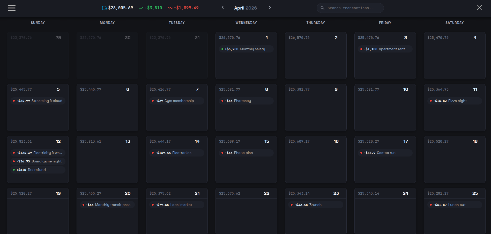
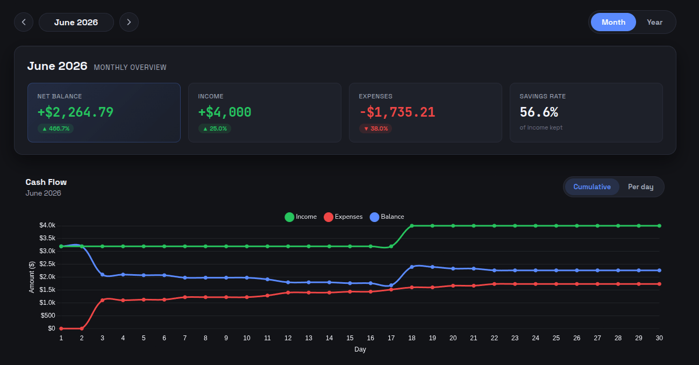
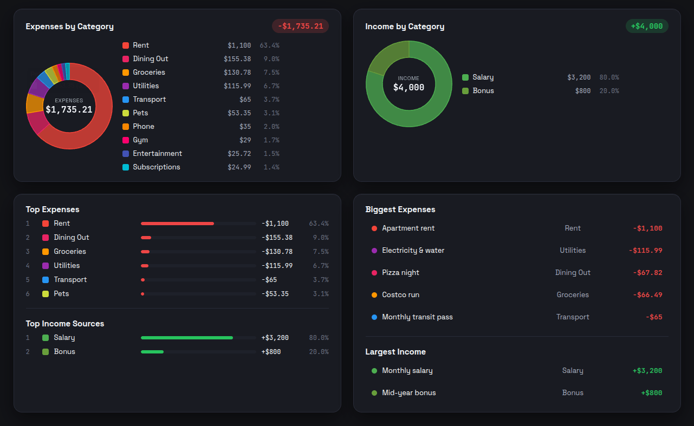
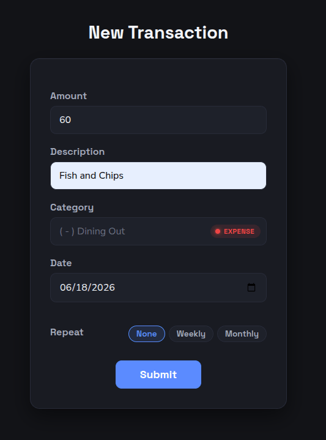
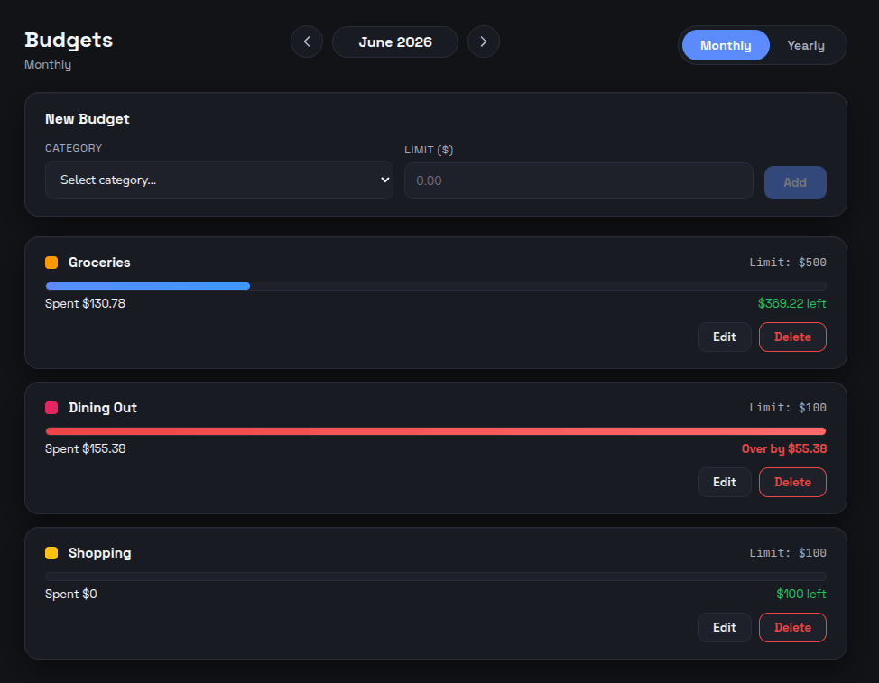
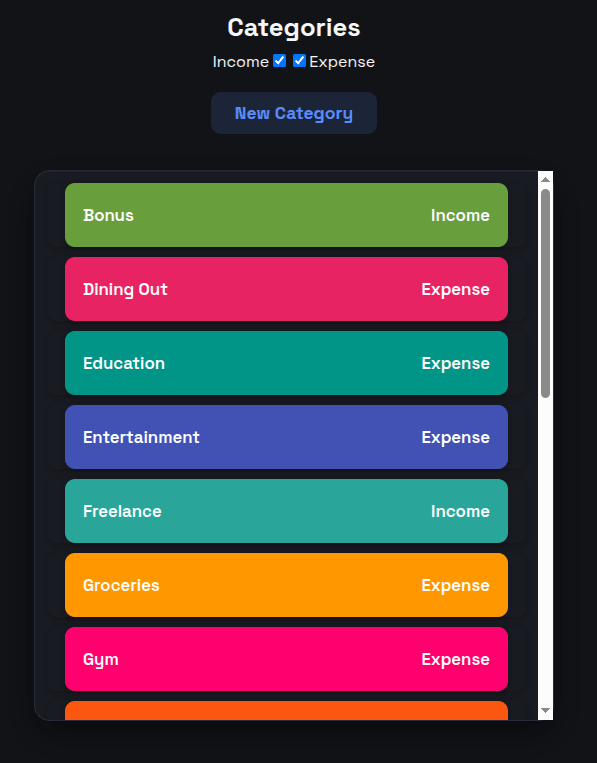
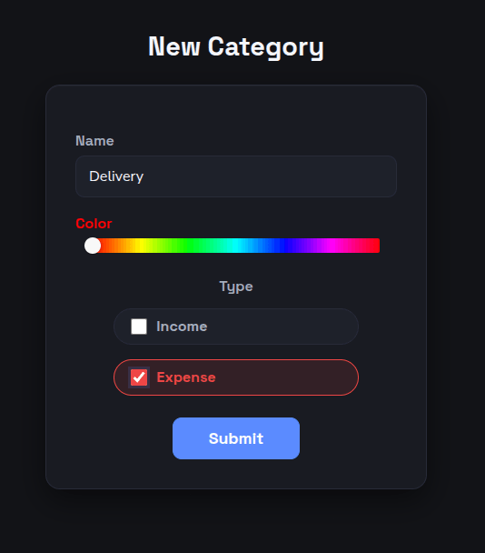

<h1 align="center"> Calendar Money </h1>

<p align="center">
💸 Full-stack cash-flow management web application built with React 18, Vite, TypeScript, Chart.js, Sass, and a Node.js + Express + MongoDB backend. Calendar-first dashboard, drag-and-drop transaction editing, deep statistics with charts, category budgets, CSV backup/restore, and a light/dark theme with accent-color customization.
</p>

<br>

## 📸 Screenshots

<table>
  <tr>
    <td colspan="2" align="center"><em>Dashboard (month view)</em></td>
  </tr>
  <tr>
    <td colspan="2" align="center"></td>
  </tr>
  <tr>
    <td align="center"><em>Statistics — KPIs + cash flow</em></td>
    <td align="center"><em>Category breakdown &amp; net worth</em></td>
  </tr>
  <tr>
    <td></td>
    <td></td>
  </tr>
  <tr>
    <td align="center"><em>New transaction</em></td>
    <td align="center"><em>Budgets</em></td>
  </tr>
  <tr>
    <td></td>
    <td></td>
  </tr>
  <tr>
    <td align="center"><em>Categories</em></td>
    <td align="center"><em>New category</em></td>
  </tr>
  <tr>
    <td></td>
    <td></td>
  </tr>
</table>

<br>

## 🌐 Live demo

- This frontend is intended to run locally together with the **[calendar-money-api](https://github.com/nady4/calendar-money-api)** backend. A hosted demo is not provided.
- To explore the flow, register a new account, then use the API's `seed` script or the in-app **Export / Import CSV** section to load sample data.

<br>

## ✨ Features

### 🗓️ Dashboard

- **Monthly calendar** as the primary surface — each day cell shows the day number, the running balance, and the transactions that fell on that day, color-coded by category.
- **Start-week-on-Monday** toggle (Account → Preferences) reshuffles the grid and the weekday header in real time.
- **Drag-and-drop transactions between days** — pick up a transaction in a day cell, drop it on another day, and the date updates instantly via a `PUT /transactions/:userId`. Repeating series (weekly / monthly) are kept intact by tagging every member with the same `group` uuid and propagating the move through the backend.
- **Global transaction search** from the navbar — type to find any transaction by description or category name, click a result to open the edit page.
- **Date-changer arrows** in the navbar step the dashboard by month (or by year on the Stats view); tapping the month label opens a per-month strip with income / expense / balance totals.

### 📈 Statistics

- **Period selector** (Month / Year) and **period navigator** with prev / next buttons.
- **KPI hero** — Net, Income, Expenses and Save-rate for the selected period, with deltas against the previous period.
- **Cash-flow chart** — income / expenses / balance over the days (or months) with a Cumulative / Per-day toggle.
- **Income & Expense donuts** with a center total and a legend showing $ amount and % share per category.
- **Top categories** ranked list with progress bars, % of type, and over-budget highlighting.
- **Biggest expenses / largest income** lists — click a row to open the edit page.
- **All-time net-worth chart** with date axis, current value, and total change.

### 🎯 Budgets

- Per-category budgets with **monthly or yearly** scope.
- **Progress bars** that turn red when you go over, and a live "Over by $X" / "$X left" message.
- **Add / edit / delete** from the Budgets page, persisted in `localStorage` per user.
- The Budgets page also lists the **linked category breakdown** (spent vs limit) for the selected period.

### 🔁 Transactions

- **Create / edit / delete** with full validation: amount (number), description (non-empty), category (chosen from the user's categories), date (defaults to the selected calendar day), and **repeat** (None / Weekly / Monthly). The `repeat` selector is a pill row matching the preferences style.
- **Repeat expansion capped at 12** — the backend creates 12 weekly copies or 12 monthly copies and tags them with a shared `group` uuid so editing or deleting one member of the series updates or removes the whole set.
- **Color-coded category badge** on the create / edit page — green Income / red Expense indicator next to the category field so the type is obvious.
- **CSV backup & restore** from the Account page — exports categories and transactions in the exact database shape (DB columns: `date`, `amount`, `description`, `category`, `group` + `_id`), imports them through a bulk endpoint that creates missing categories and resolves references by id or name. The CSV is the single source of truth for a full restore.

### 🗂️ Categories

- Full CRUD for expense and income categories with a color picker.
- Categories are returned fully populated on the user object, so every transaction on the dashboard knows its color and type without a second fetch.

### 👤 Account

- **Edit profile** (username / email / password) with server-side validation.
- **Theme** — Dark / Light, persisted in `localStorage` and applied to the whole app via CSS custom properties. Light mode has its own token set with tuned contrast for text, borders, and shadows.
- **Accent color** — six swatches (Blue, Violet, Pink, Rose, Amber, Emerald). The chosen color is injected as a CSS custom property and every accent-driven element (active pills, focus rings, dots) updates live.
- **Start week on Monday** preference (see Dashboard).
- **Delete user** with confirmation.

### 🎨 Design & UX

- **Dark + Light theme** with a token-driven design system in `src/styles/variables.scss`. Every color, border, shadow, radius, and font is a token — swapping themes is one CSS rule.
- **Hover = size only** — buttons, cards, and day cells scale on hover, no color or background change. Keeps the UI calm and predictable.
- **Drag-and-drop UX** — global click suppression prevents the synthetic click that follows a drop from triggering the logout button (which would reload the page).
- **Landing page** with hero, six feature pills, a "closer look" preview row (dashboard, stats, budgets), an FAQ section, and a footer with a GitHub link. Uses inline SVG / CSS mockups of the real UI components so visitors see the actual design.
- **BrowserRouter** (no `/#/` in the URL) and SPA-friendly routes for Landing, Login, Register, Dashboard, Stats, Budgets, Transactions, Account, Categories (list / new / edit).
- **Mobile-friendly dashboard** — day cells scale to viewport, money container hides on mobile to give more room, weekday header collapses to single letters, and the dropdown menu is full-width on phones with an in-panel close button.

### 🔐 Auth

- Register, login, logout with JWT in `localStorage` and the user object kept in sync.
- All app routes are private; Landing, Login, Register are public.

<br>

## 🛠️ Tech stack

| Area               | Technology                                              |
| ------------------ | ------------------------------------------------------- |
| Frontend framework | React 18 + Vite 6                                       |
| Routing            | React Router 7 (`BrowserRouter`)                        |
| Language           | TypeScript                                              |
| Charts             | Chart.js 4 + react-chartjs-2                            |
| Date handling      | `@js-temporal/polyfill`                                 |
| UI components      | Material UI icons + custom SCSS                         |
| Forms / pickers    | react-color, react-toastify                             |
| Styles             | Sass (SCSS) with a design-token system                  |
| Linting            | ESLint                                                  |
| Backend (separate) | Node.js + Express + Mongoose (see `calendar-money-api`) |
| Auth (backend)     | JWT (`jsonwebtoken`) + bcrypt                           |
| Database (backend) | MongoDB (Mongoose)                                      |

<br>

## 🏗️ Architecture

```
calendar-money/             # This repo (frontend)
├── public/
│   ├── favicon.svg
│   └── assets/docs/         # README screenshots
├── src/
│   ├── components/
│   │   ├── Dashboard/       # NavBar, Calendar, Dropdown, Footer
│   │   ├── Stats/            # CashFlow, Donuts, NetWorth, etc.
│   │   ├── Day/             # Calendar day cell + drag target
│   │   ├── Transaction/     # Transaction card
│   │   ├── Category/        # Category form
│   │   └── ThemeProvider/   # Light/dark + accent context
│   ├── hooks/               # useAuth, useValidateTransaction, useCategoryOptions, useValidateUser
│   ├── views/
│   │   ├── Landing/         # Public landing
│   │   ├── Auth/            # Login + Register
│   │   ├── Dashboard/       # Calendar + day cells
│   │   ├── Stats/           # Period KPIs + charts
│   │   ├── Budgets/         # Budget list + add form
│   │   ├── Transaction/     # List / New / Edit
│   │   ├── Category/        # List / New / Edit
│   │   └── Account/         # Profile + preferences + CSV import/export
│   ├── util/                # CSV, theme, weekStart, transactionApi, budgets, dragState, formatCurrency, etc.
│   ├── types.d.ts
│   └── styles/              # One SCSS file per area, all share `variables.scss`
```

The backend lives in a sibling repo: [`calendar-money-api`](https://github.com/nady4/calendar-money-api). It's a standard Express + Mongoose service with four controllers (`auth`, `users`, `categories`, `transactions`) and a JWT middleware.

### 🔍 Notable implementation details

- **Theme tokens as CSS custom properties** — `variables.scss` defines `--bg-app`, `--text-primary`, `--accent`, etc. on `:root` and `:root[data-theme="light"]`. SCSS variables still work (`vars.$bg-card`) because they `var(...)` the CSS custom property, so every existing component automatically responds to theme + accent changes.
- **Accent override at runtime** — `theme.ts` reads the chosen accent from `localStorage` and sets `--cm-accent` on `<html>`. The token chain (`--accent: var(--cm-accent, default)`) means the live accent overrides both the dark and light defaults without any rebuild.
- **Drag-and-drop is global** — a single `draggedIdRef` shared across all day cells, with a module-level `justDropped` flag and capture-phase click suppression on `window` to prevent the post-drop click from triggering reload buttons.
- **Repeat expansion is capped** — the backend creates 12 future rows maximum (weekly or monthly, based on `repeat`), tagged with a shared `group` uuid. The frontend never re-expands — the CSV import uses a bulk endpoint that inserts rows as-is, so backups and restores are idempotent.
- **Date arithmetic** — `@js-temporal/polyfill` everywhere (no `Date` math in components), so DST and timezone shifts don't double-count days.
- **Form validation** — `useValidateTransaction` and `useValidateUser` debounce-check inputs against the backend rules and toggle the submit button — no client-side bypass possible.

<br>

## 🚀 Getting started

### 📋 Prerequisites

- [Node.js](https://nodejs.org) 18+
- A running [calendar-money-api](https://github.com/nady4/calendar-money-api) instance (with MongoDB). See its README.

### 📦 Installation

```sh
# 📥 Clone the repository
git clone https://github.com/nady4/calendar-money

# 📂 Move to the project folder
cd calendar-money

# 📦 Install dependencies
npm install
```

### 🔑 Environment setup

Create a `.env` file (the API base URL is configurable):

```env
# Optional — overrides the default API endpoint
VITE_API_URL=https://calendar-money-api.onrender.com
```

If you don't set it, the app talks to `https://calendar-money-api.onrender.com` by default.

### 💻 Run the dev server

```sh
npm run dev
```

The app starts on `http://localhost:5173`.

### 🏗️ Build for production

```sh
npm run build
npm run preview
```

<br>

## 📜 Scripts

| Command           | Description                  |
| ----------------- | ---------------------------- |
| `npm run dev`     | Start the dev server         |
| `npm run build`   | Build for production         |
| `npm run lint`    | Run ESLint                   |
| `npm run preview` | Preview the production build |

<br>

## 📝 Notes

- The backend repo is intentionally separate — `calendar-money` is a pure-frontend Vite app. Hosting the static `dist/` on any static host (Netlify, Vercel, GitHub Pages) works as long as the host is configured to serve `index.html` for unknown routes (SPA fallback).
- The `BrowserRouter` switch (no `/#/` in the URL) requires that the host doesn't strip the path. If you self-host behind a custom server, add a catch-all that serves `index.html`.
- The mobile dashboard intentionally hides per-day transaction chips to keep day cells scannable on small screens; the per-month summary is shown above the calendar.
- The repeat expansion limit (12) and the DB-shape CSV format (with `_id`, `category`, `group`) are designed for round-trippable backups — exporting and re-importing on the same account preserves the data and the repeat group relationships.

<br>

## 📬 Contact

### 💌 Email: **dev@nady4.com**

### 💼 LinkedIn: [nady4](https://www.linkedin.com/in/nady4)

### 👩🏻‍💻 GitHub: [@nady4](https://github.com/nady4)
