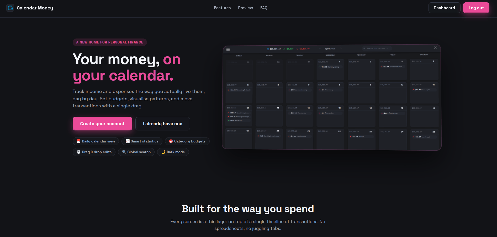

<h1 align="center"> Calendar Money </h1>

<p align="center">
💸 Full-stack cash-flow management web application built with React 18, Vite 6, TypeScript, Chart.js, Sass, and a Node.js + Express + MongoDB backend. Calendar dashboard, drag-and-drop transaction editing, deep statistics with charts, category budgets, CSV backup/restore, <b>AI receipt scanning</b> with quota & BYOK, and full light/dark theme + accent-color customization.
</p>

<br>

## 📸 Screenshots

<table>
  <tr>
    <td colspan="2" align="center"><em>Landing</em></td>
  </tr>
  <tr>
    <td colspan="2" align="center"></td>
  </tr>
  <tr>
    <td colspan="2" align="center"><em>Dashboard</em></td>
  </tr>
  <tr>
    <td colspan="2" align="center"></td>
  </tr>
  <tr>
    <td align="center"><em>Statistics — KPIs + cash flow</em></td>
    <td align="center"><em>Category breakdown &amp; net worth</em></td>
  </tr>
  <tr>
    <td></td>
    <td></td>
  </tr>
  <tr>
    <td align="center"><em>New transaction</em></td>
    <td align="center"><em>Budgets</em></td>
  </tr>
  <tr>
    <td></td>
    <td></td>
  </tr>
  <tr>
    <td align="center"><em>Categories</em></td>
    <td align="center"><em>New category</em></td>
  </tr>
  <tr>
    <td></td>
    <td></td>
  </tr>
</table>

<br>

## 🌐 Live demo


- **URL:** <b><a href="https://money.nady4.com">money.nady4.com</a></b>
- **Demo account:** username `nady4` / password `nady4` — or register a new one.

- This frontend is intended to run locally together with the **[calendar-money-api](https://github.com/nady4/calendar-money-api)** backend. A hosted demo is not provided.

<br>

## ✨ Features

### 🗓️ Dashboard

- **Monthly calendar** as the primary surface — each day cell shows the day number, the running balance, and the transactions that fell on that day, color-coded by category.
- **Start-week-on-Monday** toggle (Account → Preferences) reshuffles the grid and the weekday header in real time.
- **Drag-and-drop transactions between days** — pick up a transaction in a day cell, drop it on another day, and the date updates instantly via a `PUT /transactions/:userId`. Repeating series (weekly / monthly) are kept intact by tagging every member with the same `group` uuid and propagating the move through the backend.
- **Global transaction search** from the navbar — type to find any transaction by description or category name, click a result to open the edit page.
- **Date-changer arrows** in the navbar step the dashboard by month (or by year on the Stats view); tapping the month label opens a per-month strip with income / expense / balance totals.

### 📈 Statistics

- **Period selector** (Month / Year) and **period navigator** with prev / next buttons (period-aware: stepping by month or by year depending on the active scope).
- **KPI hero** — Net Balance, Income, Expenses and Savings Rate for the selected period. Every tile (except Savings Rate) carries a ▲/▼ delta pill against the previous period, with a special-case when the previous value is 0.
- **Cash-flow chart** — line chart with three series (Income, Expenses, Balance) over the days of the selected month or the months of the selected year. A segmented toggle switches between **Cumulative** and **Per day / Per month**.
- **Income & Expense donuts** — side-by-side doughnut charts. Each has a center total chip, a colored category legend with `$ amount` and `% share`, and a tailored tooltip (`Category: $X (Y%)`).
- **Ranked categories** — Top Expenses and Top Income Sources ranked lists, each with rank, color dot, progress bar, `$ amount` and `% of type`.
- **Notable transactions** — Biggest Expenses and Largest Income lists, clickable straight into the Edit Transaction page.
- **All-time net-worth chart** — a filled line chart with the full transaction history, current value, and the absolute change since the first point.

### 🎯 Budgets

- Per-category budgets with **monthly or yearly** scope, switched via a segmented control in the Budgets header.
- **Period navigator** (the same `PeriodNavigator` used by Stats) — `‹ / ›` buttons step the active month or year in sync with the rest of the app.
- **Progress bars** that turn red when you go over, and a live "Over by $X" / "$X left" message.
- **Add / edit / delete** from the Budgets page, persisted in `localStorage` per user (`budgets:<userId>`). Categories already covered by a budget for the active period are disabled in the picker.
- **Linked category breakdown** — the Budgets page computes the per-category spent total for the active period and shows the bar against the limit, so you can see at a glance how much of the budget is consumed.

### 🔁 Transactions

- **Create / edit / delete** with full validation: amount (number), description (non-empty), category (chosen from the user's categories), date (defaults to the selected calendar day), and **repeat** (None / Weekly / Monthly). The `repeat` selector is a pill row matching the preferences style.
- **Inline `+ New category`** — from the New / Edit form, a single click expands a small panel where you can name a category, pick Income or Expense, and choose a color from 8 swatches (or a free-form color input). On submit, the category is created via the API, the user state is updated, and the new category is auto-selected.
- **Repeat expansion capped at 12** — the backend creates 12 weekly copies or 12 monthly copies and tags them with a shared `group` uuid so editing or deleting one member of the series updates or removes the whole set.
- **Color-coded category badge** on the create / edit page — green Income / red Expense indicator next to the category field so the type is obvious.
- **Bulk import via CSV or scan review** — both the Account CSV import and the Scan Review "Add all" action go through the same `POST /transactions/bulk/:userId` endpoint. The endpoint creates missing categories on the fly and resolves category references by id or name, so imports and scan reviews share a single round-trippable format.
- **CSV backup & restore** from the Account page — exports categories and transactions in the exact database shape (DB columns: `date`, `amount`, `description`, `category`, `group` + `_id`) split into two `## categories` / `## transactions` sections. Imports parse the same file, create missing categories, and report back `imported.transactions`, `imported.categories` and `imported.skipped` counts. The CSV is the single source of truth for a full restore.

### 🗂️ Categories

- Full CRUD for expense and income categories with a color picker.
- Categories are returned fully populated on the user object, so every transaction on the dashboard knows its color and type without a second fetch.
- **Inline category creation** — both the New Transaction form and the Scan Review page expose a `+ New category` toggle so you can spin up a category (name + Income/Expense + color + 8-swatch palette) without leaving the form. The new category is created via the API, your user object is updated in state, and the new option is auto-selected on the row that asked for it.

### 👤 Account

- **Edit profile** (username / email / password) with server-side validation.
- **Theme** — Dark / Light, persisted in `localStorage` and applied to the whole app via CSS custom properties. Light mode has its own token set with tuned contrast for text, borders, and shadows.
- **Accent color** — six swatches (Blue, Violet, Pink, Rose, Amber, Emerald). The chosen color is injected as a CSS custom property and every accent-driven element (active pills, focus rings, dots) updates live.
- **Start week on Monday** preference (see Dashboard).
- **Delete user** with confirmation.

### 🧾 AI receipt scanning

- **One-tap receipt capture from the navbar** — a camera icon in the navbar opens a popover with `Take photo` (uses `capture="environment"` on a hidden file input for the rear camera on mobile), `Upload image`, and a `Drop an image here or paste from clipboard` hint. Drag-and-drop and `Ctrl/Cmd+V` paste are wired up at the popover level.
- **HEIC support** — iPhone photos (`image/heic`, `image/heif`) are decoded in the browser via `heic-decode` and re-encoded to JPEG before being sent. If decode fails, the user gets a clear toast telling them to switch iPhone Camera settings to "Most Compatible".
- **Pre-upload validation** — `prepareScanFile` checks MIME type (JPEG / PNG / WebP only), file size (≤ 10 MB), minimum long edge (200 px) and aspect ratio (warns if very long and thin), with a toast for every failure path.
- **Client-side image resize** — the largest edge is capped at 1568 px and the result is re-encoded to JPEG @ 0.8 quality so the upload to the vision endpoint stays small without losing readability.
- **Quota with live progress bar** — daily (default 10) and monthly (default 100) limits are fetched on mount via `useScanQuota` (`GET /users/:id/scan-quota`) and refreshed after every scan. The Account page shows two progress bars (one per period) that turn warning-yellow at ≥ 80 % and red at 100 %. The navbar popover shows a compact quota strip.
- **BYOK (Bring Your Own Key)** — Account → "Vision API key (BYOK)" lets you paste an OpenAI-compatible vision key. The key is sent once, tested, and stored on the server (encrypted at rest with AES-256-GCM); the UI only ever shows the last four characters. When a BYOK key is on file, the daily/monthly quota is bypassed and the popover shows `Using your own key · no daily limit`.
- **Scan Review page** — a dedicated `/scan-review` route renders the detected transactions as an editable table. Every row exposes description, amount, date, and a category cell. Recognized categories show a colored Income/Expense badge; new ones get an inline `+/−` type picker, an 8-color swatch row, and a color input. Rows can be edited, deleted, or bulk-added. A `Receipt date` input at the top of the page (with an "Apply this date to rows missing a date" toggle) lets you backfill undated rows in one click.
- **Receipt lightbox** — tapping the receipt thumbnail opens a modal (`ReceiptLightbox`) with mouse-wheel zoom, `+ / − / 0 / Esc` keyboard zoom, click-and-drag panning, and a Reset button. The zoom range is 1×–6× with a 0.2 step.
- **Cancellable in-flight scans** — the request is sent with an `AbortController` and the loading state exposes a `Cancel` button so a slow scan never blocks the page.
- **429-friendly errors** — quota exhaustion returns a 429 with the new `quota` payload, the hook updates its state, and the toast tells the user to come back tomorrow (or to add a BYOK key).

### 🎨 Design & UX

- **Dark + Light theme** with a token-driven design system in `src/styles/variables.scss`. Every color, border, shadow, radius, and font is a token — swapping themes is one CSS rule.
- **Hover = size only** — buttons, cards, and day cells scale on hover, no color or background change. Keeps the UI calm and predictable.
- **Drag-and-drop UX** — global click suppression prevents the synthetic click that follows a drop from triggering the logout button (which would reload the page).
- **Landing page** with hero, six feature pills, a "closer look" preview row (dashboard, stats, budgets), an FAQ section, and a footer with a GitHub link. Uses inline SVG / CSS mockups of the real UI components so visitors see the actual design. The navbar adapts when you are logged in (Dashboard + Log out) vs. logged out (Log in + Get started).
- **BrowserRouter** (no `/#/` in the URL) and SPA-friendly routes for Landing, Login, Register, Dashboard, Stats, Budgets, Transactions, Account, Categories (list / new / edit), and **Scan Review**.
- **Mobile-friendly dashboard** — day cells scale to viewport, money container hides on mobile to give more room, weekday header collapses to single letters, and the dropdown menu is full-width on phones with an in-panel close button.
- **Loading splash** — the very first paint shows a full-screen "Loading your money" card with the favicon and an animated bar while the user is being rehydrated.

### 🔐 Auth

- Register, login, logout with JWT in `localStorage` and the user object kept in sync.
- All app routes are private; Landing, Login, Register are public.

<br>

## 🛠️ Tech stack

| Area               | Technology                                              |
| ------------------ | ------------------------------------------------------- |
| Frontend framework | React 18 + Vite 6                                       |
| Routing            | React Router 7 (`BrowserRouter`)                        |
| Language           | TypeScript                                              |
| Charts             | Chart.js 4 + react-chartjs-2                            |
| Date handling      | `@js-temporal/polyfill`                                 |
| UI components      | Material UI icons + custom SCSS                         |
| Forms / pickers    | react-color, react-toastify                             |
| Validation         | `zod` (Register form + scan payload)                    |
| Image processing   | `heic-decode` (HEIC/HEIF → JPEG in-browser)             |
| Package manager    | npm (lockfile committed) and pnpm (lockfile + workspace hint committed) |
| Styles             | Sass (SCSS) with a design-token system                  |
| Linting            | ESLint                                                  |
| Backend (separate) | Node.js + Express + Mongoose (see `calendar-money-api`) |
| Auth (backend)     | JWT (`jsonwebtoken`) + bcrypt                           |
| Database (backend) | MongoDB (Mongoose)                                      |
| Vision (backend)   | OpenAI-compatible vision model (configurable via `VISION_API_BASE` / `VISION_MODEL`) |

<br>

## 🏗️ Architecture

```
calendar-money/             # This repo (frontend)
├── public/
│   ├── favicon.svg
│   └── assets/docs/         # README screenshots
├── src/
│   ├── components/
│   │   ├── Dashboard/       # NavBar (search + scan popover), Calendar, Dropdown, Footer
│   │   ├── Stats/           # KpiHero, CashFlowChart, CategoryDonut, RankedCategories,
│   │   │                    # NotableTransactions, NetWorthChart, PeriodNavigator
│   │   ├── Day/             # Calendar day cell + drag target
│   │   ├── Transaction/     # Transaction card
│   │   ├── Category/        # Category card
│   │   ├── ReceiptLightbox  # Zoomable full-screen receipt preview
│   │   ├── ThemeProvider/   # Light/dark + accent context
│   │   └── themeContext.ts  # React context for the theme provider
│   ├── hooks/               # useAuth, useValidateTransaction, useCategoryOptions,
│   │                        # useValidateUser, useScanQuota
│   ├── views/
│   │   ├── Landing/         # Public landing page
│   │   ├── Auth/            # Login + Register
│   │   ├── Dashboard/       # Calendar + day cells
│   │   ├── Stats/           # Period KPIs + charts
│   │   ├── Budgets/         # Budget list + add form + period navigator
│   │   ├── Transaction/     # List / New / Edit / ScanReview
│   │   ├── Category/        # List / New / Edit
│   │   └── Account/         # Profile + preferences + CSV import/export + scan quota + BYOK
│   ├── util/                # api, theme, weekStart, transactionApi, scanApi, scanUpload,
│   │                        # scannedImageHolder, csvTransactions, budgets, dragState,
│   │                        # functions (date/aggregation math), chartUtils, constants
│   ├── types.d.ts           # Shared TS interfaces (Category, Transaction, User, Budget,
│   │                        # ScannedResult, ScanQuota, VisionKeyStatus, ...)
│   └── styles/              # One SCSS file per area, all share `variables.scss`
│                            # (variables, auth, buttons, form, list, list-item, Calendar,
│                            # Day, Dropdown, Footer, NavBar, Stats, Budgets, Landing,
│                            # loading, ScanReview)
├── docs/                    # Backend contracts (e.g. scan-invoice-endpoint)
├── eslint.config.js
├── vite.config.ts
├── tsconfig.json
└── package.json
```

The backend lives in a sibling repo: [`calendar-money-api`](https://github.com/nady4/calendar-money-api). It's a standard Express + Mongoose service with four controllers (`auth`, `users`, `categories`, `transactions`) and a JWT middleware. The new scan flow uses two extra endpoints (`POST /transactions/scan/:userId`, `GET/PUT/DELETE /users/:id/vision-key`, `GET /users/:id/scan-quota`) — the wire format is documented in [`docs/scan-invoice-backend-contract.md`](./docs/scan-invoice-backend-contract.md).

### 🔍 Notable implementation details

- **Theme tokens as CSS custom properties** — `variables.scss` defines `--bg-app`, `--text-primary`, `--accent`, etc. on `:root` and `:root[data-theme="light"]`. SCSS variables still work (`vars.$bg-card`) because they `var(...)` the CSS custom property, so every existing component automatically responds to theme + accent changes.
- **Accent override at runtime** — `theme.ts` reads the chosen accent from `localStorage` and sets `--cm-accent` on `<html>`. The token chain (`--accent: var(--cm-accent, default)`) means the live accent overrides both the dark and light defaults without any rebuild.
- **Drag-and-drop is global** — a single `draggedIdRef` shared across all day cells, with a module-level `justDropped` flag and capture-phase click suppression on `window` to prevent the post-drop click from triggering reload buttons.
- **Repeat expansion is capped** — the backend creates 12 future rows maximum (weekly or monthly, based on `repeat`), tagged with a shared `group` uuid. The frontend never re-expands — the CSV import uses a bulk endpoint that inserts rows as-is, so backups and restores are idempotent.
- **Date arithmetic** — `@js-temporal/polyfill` everywhere (no `Date` math in components), so DST and timezone shifts don't double-count days.
- **Form validation** — `useValidateTransaction` and `useValidateUser` debounce-check inputs against the backend rules and toggle the submit button — no client-side bypass possible. `useValidateUser` is a `zod` schema (3–20 char username, valid email, 8+ char password with at least one letter and one number).
- **Receipt scan pipeline** — `prepareScanFile` validates the file client-side (MIME, size, dimensions, aspect ratio), decodes HEIC if needed, then `extractTransactionsFromImage` resizes the largest edge to 1568 px, re-encodes to JPEG @ 0.8 quality, and POSTs the multipart form to `/transactions/scan/:userId`. The backend proxies the image to the configured vision model and returns `{ date, transactions: [...] }`. The frontend re-resolves category names → ids and POSTs to `/transactions/bulk/:userId`, which is the same endpoint the CSV import uses. This means **scan → bulk and CSV import are the same write path**.
- **Quota lives on the server, mirrored in the hook** — `useScanQuota` keeps a `{ usedDay, limitDay, usedMonth, limitMonth, resetsAt }` record, hydrated by `GET /users/:id/scan-quota` and patched via `applyFromResponse` from every scan response (success and 429). The hook's `byok` flag flips when the user has a vision key on file and the navbar + Account UIs both react.
- **Cancellable requests** — the scan fetch receives an `AbortSignal` from the `ScanReview` page; the user can hit `Cancel` mid-flight to abort the request and reset the loading state.
- **Bulk endpoint contract** — `POST /transactions/bulk/:userId` accepts `{ categories: [{_id?, name, type, color}], transactions: [{_id?, date, amount, description, category, group?}] }`, creates missing categories by name, dedupes by `(_id)` for transactions, and returns `{ user, imported: { categories, transactions, skipped } }`. The CSV backup and the scan review both go through this single endpoint, so the import path is unified.
- **Image holding across routes** — the chosen `File` is held in a tiny module-level singleton (`scannedImageHolder`) so the navbar popover, the navigate to `/scan-review`, and the actual `ScanReview` page can all access the same `File` instance without serializing it to `localStorage` (which can't hold a `File`).
- **Inline category creation** — both `NewTransaction` and `ScanReview` share the same "add new category" panel pattern (name + Income/Expense pill + 8-swatch palette + free-form color). On create, the new category is patched into the user state and auto-selected on the originating row.

<br>

## 🚀 Getting started

### 📋 Prerequisites

- [Node.js](https://nodejs.org) 18+ (or use pnpm ≥ 8 — both lockfiles are committed)
- A running [calendar-money-api](https://github.com/nady4/calendar-money-api) instance (with MongoDB). See its README. If you want the AI receipt scanning to work, the backend also needs `VISION_API_KEY` and (optionally) `SCAN_DAILY_LIMIT` / `SCAN_MONTHLY_LIMIT` env vars — see [`docs/scan-invoice-backend-contract.md`](./docs/scan-invoice-backend-contract.md).

### 📦 Installation

```sh
# 📥 Clone the repository
git clone https://github.com/nady4/calendar-money

# 📂 Move to the project folder
cd calendar-money

# 📦 Install dependencies (npm or pnpm — both lockfiles committed)
npm install
# or: pnpm install
```

### 🔑 Environment setup

Create a `.env` file (the API base URL is configurable):

```env
# Optional — overrides the default API endpoint
VITE_API_URL=https://calendar-money-api.onrender.com
```

If you don't set it, the app talks to `https://calendar-money-api.onrender.com` by default. The backend reads (and the docs detail) the scan-related env vars: `VISION_API_KEY`, `VISION_API_BASE`, `VISION_MODEL`, `SCAN_DAILY_LIMIT`, `SCAN_MONTHLY_LIMIT`, `BYOK_ENCRYPTION_KEY`, `VISION_API_MAX_BYTES`.

### 💻 Run the dev server

```sh
npm run dev
# or: pnpm dev
```

The app starts on `http://localhost:5173`.

### 🏗️ Build for production

```sh
npm run build
npm run preview
# or: pnpm build && pnpm preview
```

<br>

## 📜 Scripts

| Command           | Description                  |
| ----------------- | ---------------------------- |
| `npm run dev`     | Start the dev server         |
| `npm run build`   | Build for production         |
| `npm run lint`    | Run ESLint                   |
| `npm run preview` | Preview the production build |

<br>

## 📝 Notes

- The backend repo is intentionally separate — `calendar-money` is a pure-frontend Vite app. Hosting the static `dist/` on any static host (Netlify, Vercel, GitHub Pages) works as long as the host is configured to serve `index.html` for unknown routes (SPA fallback).
- The `BrowserRouter` switch (no `/#/` in the URL) requires that the host doesn't strip the path. If you self-host behind a custom server, add a catch-all that serves `index.html`.
- The mobile dashboard intentionally hides per-day transaction chips to keep day cells scannable on small screens; the per-month summary is shown above the calendar.
- The repeat expansion limit (12) and the DB-shape CSV format (with `_id`, `category`, `group`) are designed for round-trippable backups — exporting and re-importing on the same account preserves the data and the repeat group relationships.
- The AI receipt scan is **stateless on the frontend** — no image is ever persisted to `localStorage` or IndexedDB. The file is held in a module-level `File` reference between the navbar popover and the `/scan-review` page, and is released as soon as the user navigates away.
- The scan quota and the BYOK key are **per-user** and live entirely on the server. The frontend only mirrors them in memory for UI purposes; the next page load refetches the truth from `GET /users/:id/scan-quota` and `GET /users/:id/vision-key`.

<br>

## 📬 Contact

### 💌 Email: **dev@nady4.com**

### 💼 LinkedIn: [nady4](https://www.linkedin.com/in/nady4)

### 👩🏻‍💻 GitHub: [@nady4](https://github.com/nady4)
